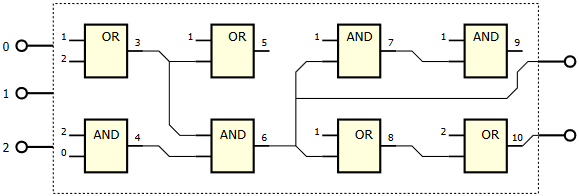
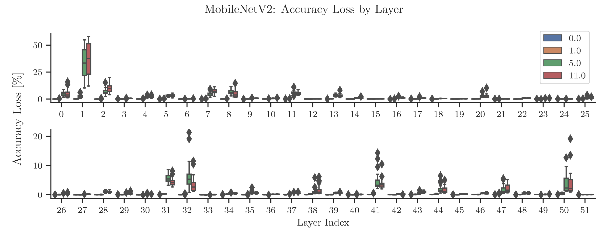
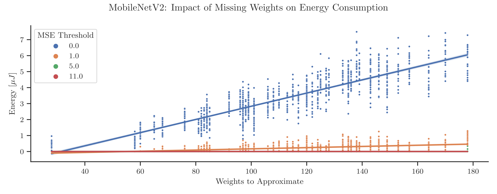

# Automated Compression of Neural Network Weights

The following work was done as part of my master's thesis which researched how weight compression can reduce energy consumption
using symbolic regression. The idea builds on the idea that memory access is in fact very demanding and requires considerate amount of energy.
This can be seen in figure below which showcases energy consumption by memory type.


Neural Networks are known to contain large amounts of weights which are essential for them to function. To reduce weight quantity several methods (such as
quantization, pruning, **compression**, **convolution**, etc.) were proposed by other researchers resulting in smaller networks. 
Smaller networs perform less calculations and memory reads which in turn decreases energy consumption at the cost of accuracy loss and error function loss.

Despite of accuracy loss it still worthy to experiment with model perfomance and energy savings. Interestingely, Convolution Neural Networks
even improved network accuracy using less weights. The same effect was also observed in quantization and this thesis. 

## Weight Compression Algorithm

One of the mentioned techniques is known as **compression** which is based on algorithms looking for some function which with
**decreased number of weights can infer remaining weights**. Or in other case it can be function which will find a way to
**encode information in less bits** as it was done in other study by [Èoupek](https://www.vut.cz/en/students/final-thesis/detail/148487).

This thesis build on the first method that nicely works with hardware. Compression function is a circuit with grid
layout of arbitrary number of rows and columns. Each element (circuit gate) represents a mathematical operator of choice. 
Every gate can connect to previous gates or function input (network weights). The whole circuit is evaluated from inputs that
are connected to gates until last gate forwars result to output that represent infered weights. For demonstration,
refer to image below created by [Vašíèek and Bidlo](https://doi.org/10.1109/CEC.2011.5949628).



To find such function Cartesian Genetic Programming (CGP) was employed. CGP is an optimization algorithm ideal for symbolic regression
and hardware optimization. Lately, CGP expanded its use from just accuracy optimization to optimization of other circuit metrics such
an energy consumption which makes it especially fit for this task. Another strength of the algorithm is its limited grid size
that corresponds with production environment compared to common Genetic Algorithms.

## Results

Collected data indicate the solution could work on CNN single layer. However, scalability of the proposed algorithm 
is limited accross layers which makes it unusable for production. Furthermore, TPU integration was not researched 
at all in the time of working on this thesis. For more information see sections Limitations and Ideas.

Regarding compression properties several interesting observations were made. The most signifanct finding is that each
layer has unique sensitivity to weight changes which are co-product of approximate weight inference. Layers
in LeNet-5 were not very sensitive at all and more aggresive energy optimization strategy could be used. Resulting in
zero energy costs in weight inference. On the other hand most of the MobileNetV2 layers showed similar behaviour however
some layers were very sensitive for weight changes and aggresive strategies became unusable. Which is problematic and limiting.



Another observation is that energy consumption of compression circuits grows with the amount of weights that must be
approximated (for reference see figure below). Which sounds logical and apparent although it reveals some interesting implications. The more unique weights
are given as input the more likely it is to reach very low energy use. For example, given 8-bit numbers and 255 unique weights
energy consumption would be zero as it can be just simply rewired by CGP (mapping input to output by wire). On the opposite case given just single unique weight the CGP
algorithm needs to use more costly operations to get exact infered weight.



Finally, on single layer the algorithm turned out to be very efficient in terms of energy consumption indicating
there might be opportunuties to research how to overcome limitations and possible make it usable in production.

## Limitations

CGP algorithm is capable of finding circuit configurations. Even for multiple layers and to share the same grid however in order to do that
multiplexers are used. And these multiplexers cost some energy which slowly accumulates. Their use is to distinguis which
gate output to use as for example one layer might expect weight 1 and the other weight 120. In case multiplexer was not used the 
weight difference would be way too much resulting in significant accuracy losses.

The previous limitation also makes the proposed algorithm impractical as for now it is not possible to deploy to any
TPU. The found circuit would require TPU to have free processing units to perform requested operators and correctly route them.

As it is usual in Genetic Algorithms (and CGP) their speed is not very pleasant to work with. It is caused by their
meta-heurestic way of searching solution space and trying out every solution created from previous solution by evolution
explained into more detail in thesis. Due to this fact compression function exploration is very slow process.

## Ideas

Currently there are 2 crucial problems with the algorithm. First, it would be very beneficial to find a way how to enable
multi-layer support with less sever energy penalties. Second, in TPU integration it could be possible to modify compiler
part on LLVM backend which works with TPU target.

Implementation uses heavily OpenMP vectorization and parallelism and might contain unoptimal memory aligments which causes perfomance
loss. Moreover, implemented graph algorithms can hide potential for perfomance gains. In terms of GPU acceleration it was not
implemented at all because how scheduling worked in OpenPBS on Metacentrum. Therefore, GPU can be very likely utilized.

## What is Included

This repository contains only the implementation code. The experiments data are hosted on
[NextCloud](https://nextcloud.fit.vutbr.cz/s/9D8TYLGnezzGaHH) in 
`data_store.zip` accomodated with conda environment compressed in `pytorch_env.tar.zip`.
Although, Jupyter Notebooks can be also viewed and are available in the 
cmd/compress directory, each covering one experiment.

### Install

To install all dependencies, the Conda environment has been exported to conda-requirements.txt with pip requirements listed in requirements.txt. If this installation method fails, the project depends on the following packages: PyTorch, pandas, numpy, seaborn, parse, tqdm, scipy, scikit-posthocs, and Python 3.11.5. This does not need to be
followed on MetaCentrum, because the environment is bundled in `pytorch_env.tar`.

If computations are to be performed on Metacentrum, the scripts operate in $HOME/cgp_workspace, where the CGP project must be copied to $HOME/cgp_workspace/cgp_cpp_project, and experiments must be copied to $HOME/cgp_workspace/experiments_folder. This can be done by running `scp -r metacentrum/structure/* zenith:~/` which will copy all dependencies.
Then copied scripts from `scripts` and `jobs` folders must be changed by `chmod +x <script>`. The `pytorch_env` should be placed in ~/python directory in MetaCentrum.

For local development, CGP can be compiled using Visual Studio or the provided Makefile. Subsequently, the .env file should be set, for instance: cgp=C:\\Users\\Majo\\source\\repos\\TorchCompresser\\out\\build\\x64-release\\cgp\\CGP.exe and datastore=C:\\Users\\Majo\\source\\repos\\TorchCompresser\\data_store. If MobileNetV2 is being tested, huggingface=<token> should also be set.

### MetaCentrum Experiments

The common practice is to generate experiments locally using python `./cmd/compress/compress.py <experiment_name>:train-pbs ...` and then sending them to
MetaCentrum frontend server `scp -r <some path>/<experiment_name> zenith:~/cgp_workspace/experiments_folder`. Then, through ssh access the experiment directory
which can be queued up with `qsub train.pbs.sh`. Or in case of composite experiments, all of the unstarted experiments can be queued up using `~/scripts/resub.sh`.

### Usage

To train in simple way, for example: 

```sh
python ./cmd/compress/compress.py layer_bypass:train qat_quantized_lenet qat.quantized_lenet.pth --population-max 8 --experiment-env ./local_experiments/ --patience 500000 --mse-thresholds 0 -e 0  --rows 256 --cols 31 --mutation-max 0.01
```

To generate PBS experiments, for example: 

```sh
python ./cmd/compress/compress.py le_selector:train-pbs qat_quantized_lenet qat.quantized_lenet.pth --time-limit 48:00:00 --template-pbs-file ./compress/experiments/job.pbs --population-max 8 --mem 500mb --experiment-env experiment-pbs --scratch-capacity 20gb -b 30 --patience 10000000 --mse-thresholds 0 --rows 256 --cols 31 --mutation-max 0.01 --multiplex
```

To obtain model metrics, for instance: 

```sh
python ./cmd/compress/compress.py le_selector:model-metrics qat_quantized_lenet qat.quantized_lenet.pth --experiment *_256_31  -s "statistics.{run}.csv.zip" --top 1 --dataset qmnist --split nist --num-workers 4 --num-proc 1 --batch-size 40 --include-loss --e-fitness SE
```

Please note that the flag -s might differ depending on how it was bundled on MetaCentrum using the experiment.sh script in the metacentrum folder. The script is used in the following way, assuming the working directory is in the experiment results that were batched into smaller batches.

```sh
experiment.sh merge <experiment_name without _batch_x> 31 all
```

It is important to note that models are loaded from data_store if their values were not specified with the option -m. The program has many more utilities, but these are the most frequently used.

### Experiment Notes

I forgot to mention in the thesis text that the population size for the LeNet-5 Approximation experiment was changed from 16 to 8. Subsequent experiments MobileNetV2, No Input (le_selector) and all_layers used 4 population size, despite the cgp_configs indicating 8. It was decided that every chromosome should be evaluated by at least 2 vCPU, so half of the population is removed, as set in the `population_max` parameter. This is technical debt of the CGP implementation caused by flawed CLI argument parsing.

Furthermore, calculations were primarily done on MetaCentrum on various servers like nympha, tarkil, or kirke. Local experiments were not published as they were solely used for development, and I had to discard them due to mistakes made at the time.

## License

Provided software and other files are licensed under [Apache License 2.0](https://choosealicense.com/licenses/apache-2.0/).
